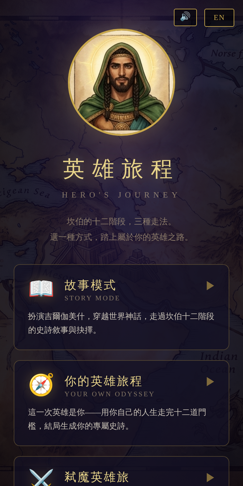
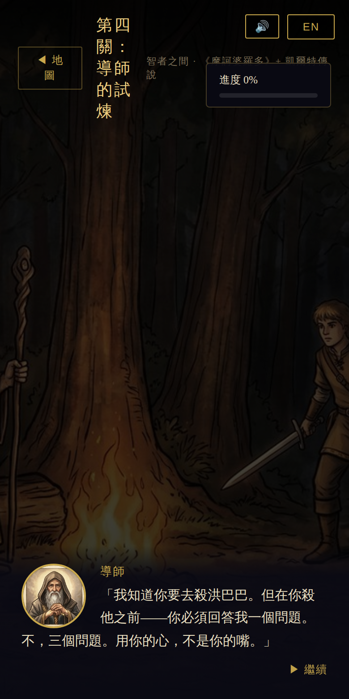
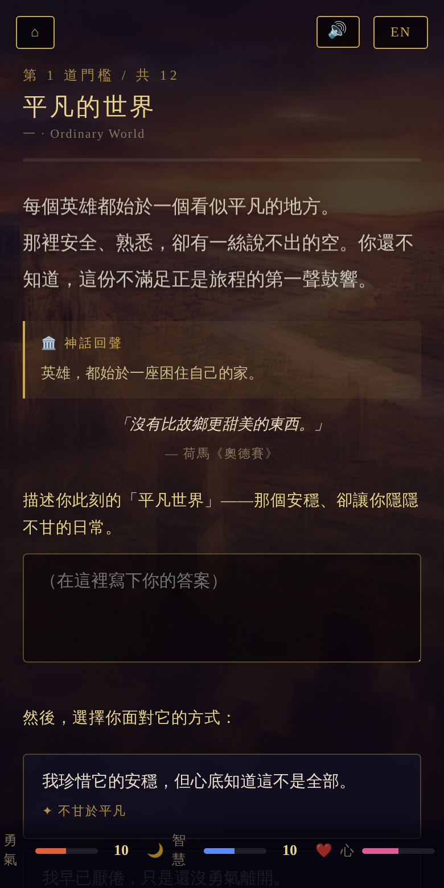
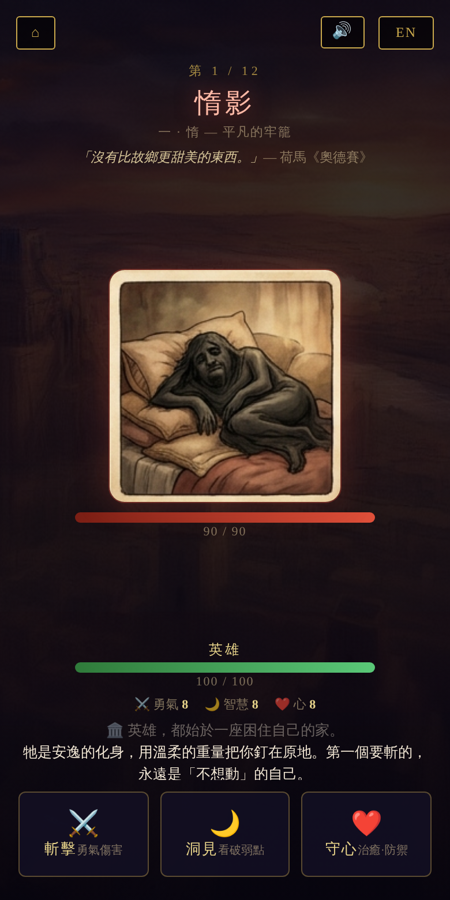
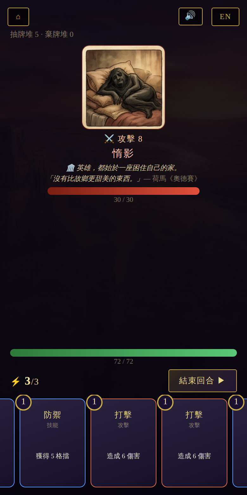
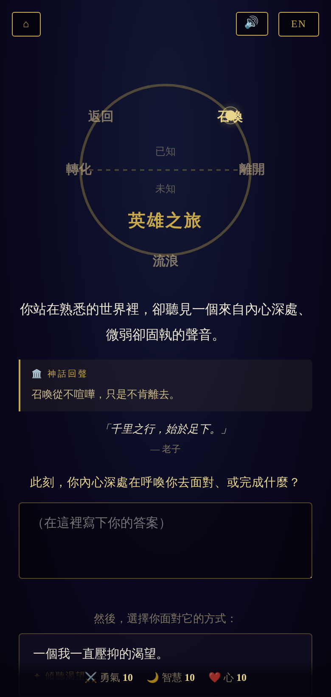

# 英雄旅程 · The Hero's Journey

坎伯（Joseph Campbell）／佛格勒十二階段的視覺化專案：**一個入口，五種玩法**，共享同一套水彩美術、史詩音樂，以及跨文化的神話隱喻（奧德賽、吉爾伽美什、西遊記、北歐…皆公有領域）。

A visualization of Campbell / Vogler's twelve stages of the Hero's Journey: **one entrance, five ways to play**, sharing one set of watercolor art, an epic synth score, and cross-cultural mythic echoes (Odyssey, Gilgamesh, Journey to the West, Norse… all public domain).

▶ **Play online / 線上遊玩：https://cyysongyy.github.io/heros-journey/**

> 每種模式都是**單一 HTML、離線可玩、中英雙語**。右上 `EN` 切換語言、`🔊` 開關音樂；左上 `⌂` 回選單。首次需**點一下畫面**音樂才會開始。
> Each mode is a **single offline HTML file, bilingual (中/EN)**. Top-right: `EN` language, `🔊` music; top-left `⌂` back to menu. **Tap once** to start the music (browser autoplay rule).

<p align="center">
  
</p>

---

## 五種玩法怎麼玩 · How to Play

### 📖 故事模式 · Story Mode — `heros_journey_game.html`



**中文**：扮演**吉爾伽美什**，依十二階段走完一趟史詩。從圓環地圖選關；每關先看「**神話回聲卡**」（神話呼應＋經典引言），再讀史詩對話並完成小遊戲或抉擇（探索熱點、拖曳天平、潛行、作答…）。選擇養成三屬性 **⚔️勇氣／🌙智慧／❤️心**。12 關全通後，依屬性獲得英雄稱號，並依你最後的作答獲得一段**正向寄語**。

**EN**: Play **Gilgamesh** through the twelve stages. Pick a node on the ring-map; each stage opens with a **Mythic Echo card** (a myth parallel + a classic quote), then epic dialogue and a mini-game or choice (explore hotspots, tip a scale, sneak, answer…). Choices raise **⚔️Courage / 🌙Wisdom / ❤️Heart**. Clear all 12 for a hero title and a **positive closing word** drawn from your final answer.

<br clear="all">

### 🧭 你的英雄旅程 · Your Own Odyssey — `your_odyssey.html`



**中文**：這一次英雄是**你**。每道門檻有旁白＋神話回聲＋引言，然後一題**反思提問**——在空白欄**寫下你的答案（必填）**，再**選擇你面對它的方式**（養成三屬性）。結局用你親手寫的話編成**專屬史詩**、給你一個英雄原型，並附一段依你答案生成的**「給英雄的建議」**（正向）。

**EN**: This time **you** are the hero. Each threshold gives narration + a mythic echo + a quote, then a **reflective question** — **write your own answer (required)** and **choose how you meet it** (raising the three virtues). The ending forges a **personal epic** from your words, names your archetype, and adds a positive **"A Word for You"** built from your answers.

<br clear="all">

### ⚔️ 弒魔英雄旅 · Trials of the Twelve Beasts — `beast_trials.html`



**中文**：回合制戰鬥，依序斬過**十二頭心魔**（惰→懼→…→心魔·你自己），每頭＝一個要戰勝的內在自我。每回合選：**⚔️斬擊**（勇氣傷害）／**🌙洞見**（看破弱點、傷害更高）／**❤️守心**（治癒＋防禦）。看敵人**意圖預告**決定攻守；心魔各有機制（傲魔反彈、怒炎暴走、絕望回血…）。擊敗一頭獲得美德與生命上限，**倒下可「重新站起」**。

**EN**: Turn-based combat against the **twelve inner demons** (Sloth → Fear → … → the Shadow, Yourself) — each a self to overcome. Each turn choose **⚔️Strike** (Courage dmg) / **🌙Insight** (pierce, higher dmg) / **❤️Ward** (heal + defend). Read the enemy's **intent** to attack or guard; demons have gimmicks (Pride reflects, Wrath enrages, Despair regenerates…). Wins grant virtues and max HP; if you fall, **rise again**.

<br clear="all">

### 🃏 英雄牌旅 · The Deckbound Hero — `deck_trials.html`



**中文**：Roguelite **卡牌構築**（類《殺戮尖塔》）。每回合有**能量（⚡3）**，打出手牌：**攻擊牌**造成傷害、**技能牌**格擋／抽牌／減益、**能力牌**永久強化；按「結束回合」換敵人依意圖行動。**地圖**每層選路：⚔️打怪／🔥精英／❓事件／🛏️休息／💰寶藏；戰後**三選一加牌**、取得神器與金幣。血量歸零則本局結束（**死亡重來、越戰越強**），擊敗最終 BOSS 獲勝。

**EN**: A roguelite **deckbuilder** (Slay-the-Spire-like). Each turn you have **energy (⚡3)**: play **attacks** for damage, **skills** for block/draw/debuffs, **powers** for permanent buffs; "End Turn" lets the enemy act on its intent. On the **map**, choose a path each floor: ⚔️battle / 🔥elite / ❓event / 🛏️rest / 💰treasure; after a fight, **draft 1 of 3 cards** and gain relics & gold. Reach 0 HP and the run ends (**die, rebuild, grow stronger**); beat the final boss to win.

<br clear="all">

### 🌀 內在英雄之旅 · The Inner Journey — `inner_journey.html`



**中文**：向內的旅程，走的是英雄之旅的**圓環**——**召喚 → 離開原地 → 跨界流浪 → 轉化 → 返回**，跨越「已知」與「未知」的門檻。畫面上有一個**會隨進度轉動的圓環圖**。每一站給你一題**向內的提問**（寫下你的答案，必填），再選擇你面對它的方式。結局編成一段**內在旅程的史詩**、給你一個內在原型（內在的勇者／覺醒的智者／慈悲的守護者／完整的自己）與**正向建議**。

**EN**: The journey inward follows the Hero's Journey **circle** — **Call → Departure → Wandering the Unknown → Transformation → Return** — crossing the threshold of Known and Unknown. An on-screen **ring diagram turns as you progress**. Each station asks an **inward question** (write your answer — required) and a choice. The ending forges an **inner epic**, an inner archetype (Inner Warrior / Awakened / Compassionate / Whole Self), and a positive **word for you**.

<br clear="all">

---

## 檔案 · Files

- `index.html` — 入口選單 / menu hub (links the five modes, with music)
- `heros_journey_game.html` · `your_odyssey.html` · `beast_trials.html` · `deck_trials.html` · `inner_journey.html` — 五種玩法 / the five modes (each a standalone offline file)
- `images/` — 圖像資源 / art (12 scene backgrounds, portraits `img15…img37`, twelve demons `beast1…beast12`, medal)
- `BEASTS.md` — 十二心魔美術清單／生圖說明 / beast art manifest & prompts
- `gen_all.mjs` · `gen_portraits.mjs` · `gen_beasts.mjs` · `gen_image.mjs` — 產生美術的腳本 / art-generation scripts

> 五種玩法各自獨立、無共用存檔；共用的是 `images/` 與世界觀。缺圖時以佔位（emoji／隱藏）處理，仍可正常遊玩。
> The five modes are independent (no shared save); they share only `images/` and the theme. Missing art falls back to placeholders (emoji/hidden) and the game still plays.

## 重新生成 / 產生新圖 · Regenerating Art

需要 Node.js 與 OpenAI API 金鑰，金鑰**只透過環境變數**傳入 / needs Node.js and an OpenAI key, passed **only via env var**:

```bash
export OPENAI_API_KEY="sk-..."
node gen_all.mjs ./images 1024x1024 medium        # 12 scene backgrounds
node gen_portraits.mjs ./images 1024x1024 medium  # dialogue portraits
node gen_beasts.mjs ./images 1024x1024 medium     # twelve demons
node gen_image.mjs "your english prompt" 1024x1024 images/my.png  # one image
```

- 尺寸 / size：`1024x1024`、`1024x1536`、`1536x1024`
- 品質 / quality：`low` / `medium` / `high`
- 模型 / model：`gpt-image-1`（按張計費 / billed per image）
- 生好用對應檔名放進 `images/` 覆蓋即可 / drop files into `images/` under the expected names. 也可用 Gemini 等工具依 `BEASTS.md` 生圖 / or use Gemini etc. with the prompts in `BEASTS.md`.

## 安全提醒 · Security

API 金鑰等同密碼。若曾以明碼外流，請至 platform.openai.com → API keys 立即 **revoke 換新**。
Treat the API key like a password. If it ever leaked in plaintext, **revoke and rotate** it at platform.openai.com → API keys.
